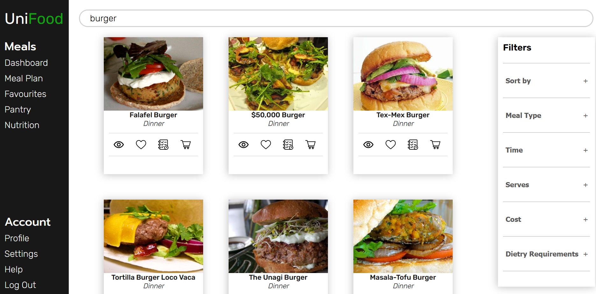

# UniFood

UniFood is an project designed to simplify meal times, providing a tool to search for recipes, generate a meal plan and get a shopping list for the created meal plan. A full-stack project utilising data generated by the spoonacular API, the frontend uses a vanilla stack of HTML, CSS and Javascript, with the backend powered by Python, Flask and JSON Web Tokens.

Design files for everything shown can be found in the github/designs folder

## Table of Contents

- [Installation Instructions](#installation)
- [Features](#features)
  - [Landing Page](#features-landing)
  - [User Accounts](#features-accounts)
  - [Dashboard](#features-dashboard)
  - [Search for Recipes](#features-search)
  - [Recipe View](#features-recipe)
- [Plans for the Future](#plans)
- [Credits](#credits)

## Installation Instructions

<a name="installation" />
Please contact one of the contributors to get instructions on how to install and load up the website. This is to maintain the security of our API and secret keys. Screenshots for every major feature are found in the next section

## Features

<a name="features" />

### Fully Responsive Landing Page

<a name="features-landing" />
Landing page made without any frameworks or libraries. Fully responsive for all device types, through the use of media queries.

While the landing page is responsive, the rest of the web app is not, leaving the potential for a future project to port this to a mobile app. The mobile landing page leaves this open, replacing the sign in buttons with prompts to download a UniFood app

### Accounts and Authentication

<a name="features-accounts" />
Flask and JWTs allows for accounts to be created, stored in a database and used around the app. This allows users to save their favourite recipes for use in meal plans and shopping lists. All user data is saved locally to the machine hosting the server. A guest mode is also available.

### Dashboard

<a name="features-dashboard" />
An overview of the users meals, providing information on upcoming meals and nutritional information (coming soon). Carousel provided by Gliderjs.

### Search Results

<a name="features-search" />
Results from the spoonacular API are provided, allowing the user to view the recipe, favourite it or add it to their meal plan or shopping list.

### Recipe View

<a name="features-recipe" />
Clicking view on a recipe takes you to the recipe page, where an overview about the recipe can be seen. In all, the user can see the ingredients, instructions, nutritional information and any other important dietry information about the recipe. Recommendations are also included

## Plans for the Future

<a name="plans" />
Future plans involve fleshing out the foundation of what we have done so far. Most of the necessary links and buttons have been implemented, so work will turn towards creating the logic and pages for it. Specifically, the plans are to:

- **Favourite Recipe** - Allow users to save a recipe to a list of favourites, saving the recipe information for fewer API calls and keeping favourites separate for the user.

- **Meal Plan** - Allow the user to create a meal plan of their chosen recipes, with the potential of automatically filling in the blank meals.

- **Shopping List** - Generate a list of ingredients from meals in the meal plan to simplify shopping.

- **Pantry** - Give the option to track ingredients in a digital pantry which can be viewed anywhere. Wondering if you need a certain ingredient while out shopping, but think you might already have it at home? Check your UniFood pantry and avoid the waste!

- **Nutrition** - Basic tracking of nutritional information, to see the calories and macronutrients in what you have been eating.

## Credits

<a name="credits" />

***[Etienne Brand](https://github.com/etiennebrandd)** - Backend developer. Creating the server and database, handling user accounts and authentication, implemented JWTs.*

***[Ethan Hawes](https://github.com/ItsEthanH)** - Frontend developer. Designed and developed web pages.*
